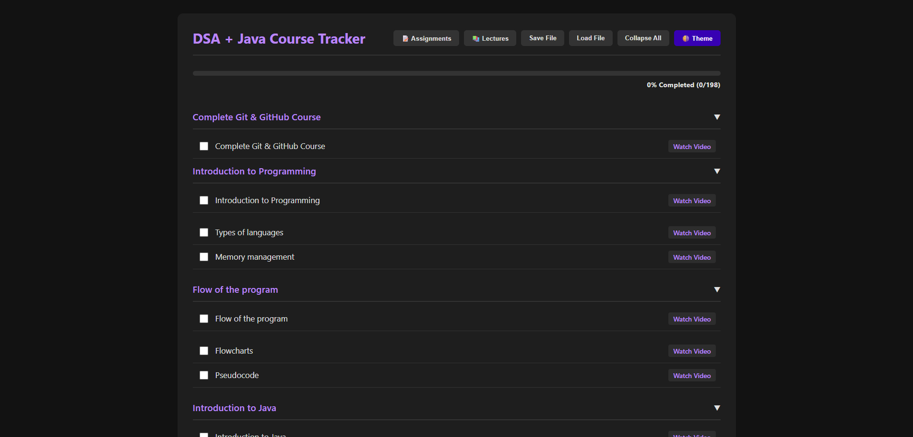
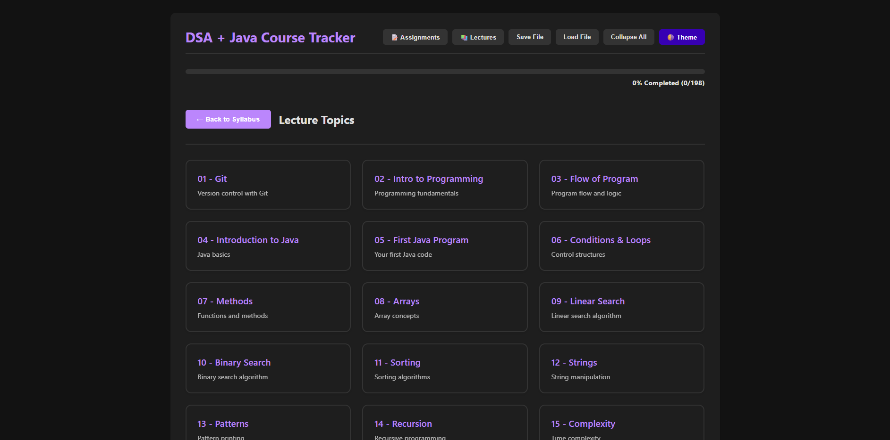
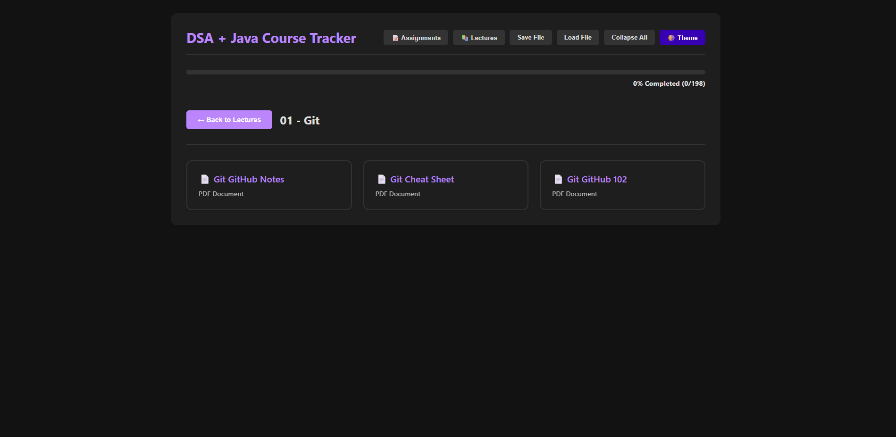

# 🚀 Complete Data Structures & Algorithms (DSA) Journey

Welcome to my complete DSA preparation repository! This repo contains everything I have learned, code snippets, resources, and a **custom-built progress tracker** to help you master Data Structures and Algorithms.

## 🌟 Live Progress Tracker
**Don't just watch tutorials—track your progress!** I have built a fully interactive, mobile-friendly Syllabus Tracker. You can use it to watch lectures, mark them as complete, and manage your assignments.

👉 **[Launch the Live Tracker Here](https://yaswanth-ampolu.neocities.org/)** 👈

> **Tip:** You can add the link above to your mobile home screen for an app-like experience!

---

## 📚 About This Repository
This repository is a documentation of my journey through the "DSA Bootcamp." It is designed to be a one-stop shop for:
- 📝 **Lecture Notes & Code:** My solutions and learnings from every topic.
- 🛠️ **Custom Tools:** A robust HTML tracker to keep you organized.
- 📂 **Resources:** Direct links to assignments and materials.

### 🏆 Special Shoutout
This entire journey is based on the legendary playlist by **Kunal Kushwaha**.
* **Source:** [Java + DSA + Interview Preparation Course](https://youtube.com/playlist?list=PL9gnSGHSqcnr_DxHsP7AW9ftq0AtAyYqJ&si=tOVfKOSmgyA7awe1)

* **Github:** [Kunal Kushwaha](https://github.com/kunal-kushwaha) @kunal-kushwaha

Big thanks to Kunal for providing high-quality, free education to the community! 🙌

---

## 📸 The Syllabus Tracker
I created a custom tool included in this repo (`@syllabus_tracker_with_all.html`) to visually manage the massive curriculum.

### **Dashboard Overview**
A clean interface to see your overall progress at a glance.

### **Assignments & Topics**
Keep track of what needs to be done vs. what is already mastered.

### **Lecture View**
Watch videos directly within the tracker with integrated note-taking context.

---

## ⚙️ How to Use The Tracker

### Option 1: The Online Version (Recommended)
For the best experience (and to use it on your phone), simply visit:
[**https://yaswanth-ampolu.neocities.org/**](https://yaswanth-ampolu.neocities.org/)

### Option 2: Local Version
If you prefer to run it offline on your machine:
1. Clone this repository.
2. Locate the file named `@syllabus_tracker.html`.
3. Open it in any web browser (Chrome, Edge, Firefox).

---

## 🤝 Contributing
If you find a bug in the code or want to improve the tracker:
1. Fork the Project
2. Create your Feature Branch
3. Commit your Changes
4. Push to the Branch
5. Open a Pull Request

---

*Star ⭐ this repository if you found it helpful! Happy Coding!*